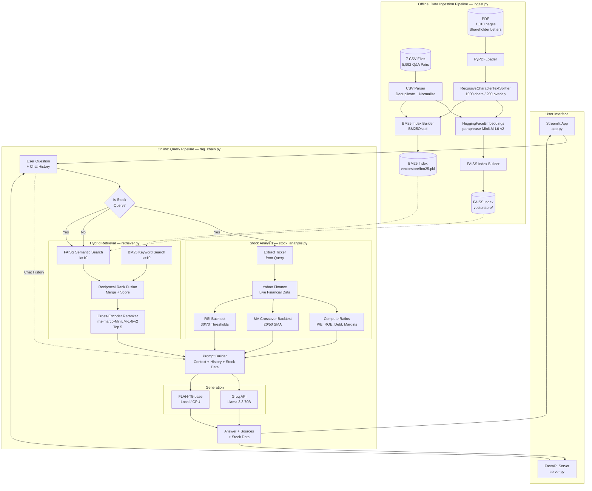
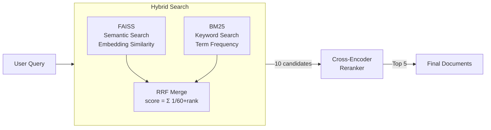
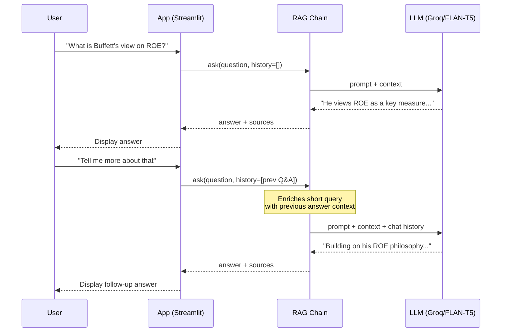
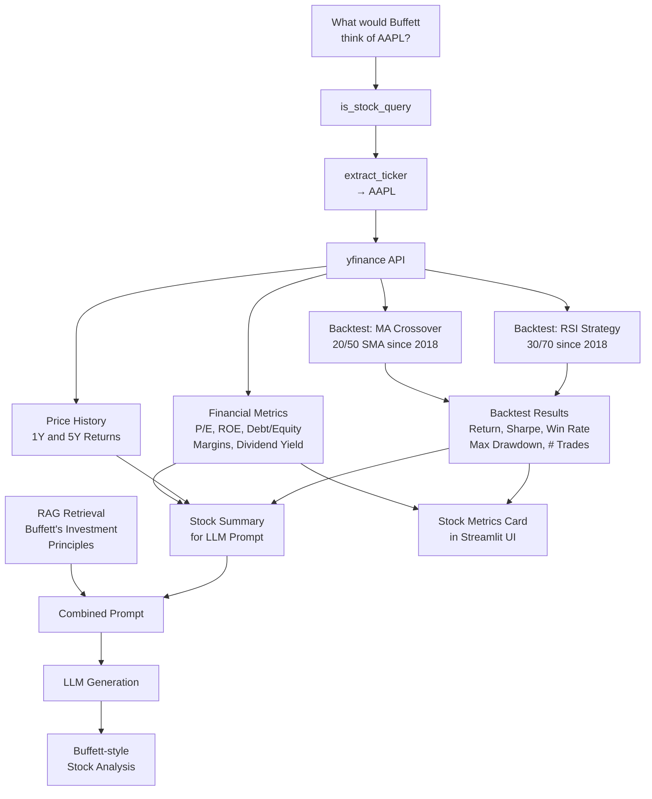
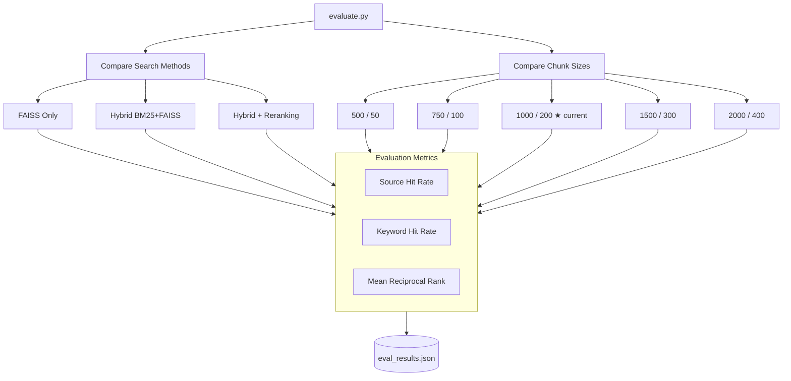
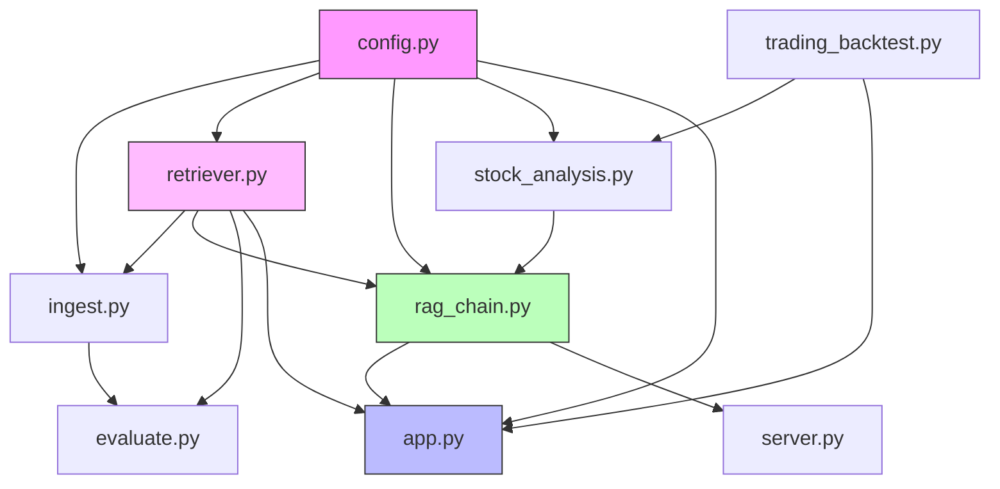

# Architecture Diagrams

## Full System Flow

```mermaid
flowchart TD
    subgraph USER["User Interface"]
        UI[Streamlit App<br/>app.py]
        API[FastAPI Server<br/>server.py]
    end

    subgraph INGESTION["Offline: Data Ingestion Pipeline — ingest.py"]
        PDF[(PDF<br/>1,010 pages<br/>Shareholder Letters)]
        CSV[(7 CSV Files<br/>5,992 Q&A Pairs)]
        LOADER[PyPDFLoader]
        SPLITTER[RecursiveCharacterTextSplitter<br/>1000 chars / 200 overlap]
        DEDUP[CSV Parser<br/>Deduplicate + Normalize]
        EMBED_BUILD[HuggingFaceEmbeddings<br/>paraphrase-MiniLM-L6-v2]
        FAISS_BUILD[FAISS Index Builder]
        BM25_BUILD[BM25 Index Builder<br/>BM25Okapi]
        FAISS_STORE[(FAISS Index<br/>vectorstore/)]
        BM25_STORE[(BM25 Index<br/>vectorstore/bm25.pkl)]

        PDF --> LOADER --> SPLITTER --> EMBED_BUILD
        CSV --> DEDUP --> EMBED_BUILD
        EMBED_BUILD --> FAISS_BUILD --> FAISS_STORE
        DEDUP --> BM25_BUILD --> BM25_STORE
        SPLITTER --> BM25_BUILD
    end

    subgraph QUERY["Online: Query Pipeline — rag_chain.py"]
        INPUT[User Question<br/>+ Chat History]
        STOCK_CHECK{Is Stock<br/>Query?}

        subgraph RETRIEVAL["Hybrid Retrieval — retriever.py"]
            FAISS_SEARCH[FAISS Semantic Search<br/>k=10]
            BM25_SEARCH[BM25 Keyword Search<br/>k=10]
            RRF[Reciprocal Rank Fusion<br/>Merge + Score]
            RERANK[Cross-Encoder Reranker<br/>ms-marco-MiniLM-L-6-v2<br/>Top 5]
        end

        subgraph STOCK["Stock Analysis — stock_analysis.py"]
            TICKER[Extract Ticker<br/>from Query]
            YF[Yahoo Finance<br/>Live Financial Data]
            RATIOS[Compute Ratios<br/>P/E, ROE, Debt, Margins]
            BACKTEST_MA[MA Crossover Backtest<br/>20/50 SMA]
            BACKTEST_RSI[RSI Backtest<br/>30/70 Thresholds]
        end

        PROMPT[Prompt Builder<br/>Context + History + Stock Data]

        subgraph LLM["Generation"]
            GROQ[Groq API<br/>Llama 3.3 70B]
            FLAN[FLAN-T5-base<br/>Local / CPU]
        end

        ANSWER[Answer + Sources<br/>+ Stock Data]
    end

    UI --> INPUT
    API --> INPUT
    INPUT --> STOCK_CHECK

    STOCK_CHECK -- Yes --> TICKER
    TICKER --> YF
    YF --> RATIOS
    YF --> BACKTEST_MA
    YF --> BACKTEST_RSI
    RATIOS --> PROMPT
    BACKTEST_MA --> PROMPT
    BACKTEST_RSI --> PROMPT

    STOCK_CHECK -- No --> FAISS_SEARCH
    STOCK_CHECK -- Yes --> FAISS_SEARCH

    FAISS_STORE -.-> FAISS_SEARCH
    BM25_STORE -.-> BM25_SEARCH

    FAISS_SEARCH --> RRF
    BM25_SEARCH --> RRF
    RRF --> RERANK
    RERANK --> PROMPT

    INPUT -.->|Chat History| PROMPT

    PROMPT --> GROQ
    PROMPT --> FLAN
    GROQ --> ANSWER
    FLAN --> ANSWER
    ANSWER --> UI
    ANSWER --> API
```

## Retrieval Pipeline Detail

```mermaid
flowchart LR
    Q[User Query] --> HS[hybrid_search]

    subgraph HS[Hybrid Search]
        direction TB
        FAISS[FAISS<br/>Semantic Search<br/>Embedding Similarity]
        BM25[BM25<br/>Keyword Search<br/>Term Frequency]
        MERGE[RRF Merge<br/>score = Σ 1/60+rank]
        FAISS --> MERGE
        BM25 --> MERGE
    end

    HS -->|10 candidates| RR[Cross-Encoder<br/>Reranker]
    RR -->|Top 5| DOCS[Final Documents]
```

## Conversation Memory Flow

```mermaid
sequenceDiagram
    participant U as User
    participant A as App (Streamlit)
    participant R as RAG Chain
    participant LLM as LLM (Groq/FLAN-T5)

    U->>A: "What is Buffett's view on ROE?"
    A->>R: ask(question, history=[])
    R->>LLM: prompt + context
    LLM-->>R: "He views ROE as a key measure..."
    R-->>A: answer + sources
    A-->>U: Display answer

    U->>A: "Tell me more about that"
    A->>R: ask(question, history=[prev Q&A])
    Note over R: Enriches short query<br/>with previous answer context
    R->>LLM: prompt + context + chat history
    LLM-->>R: "Building on his ROE philosophy..."
    R-->>A: answer + sources
    A-->>U: Display follow-up answer
```

## Stock Analysis Pipeline

```mermaid
flowchart TD
    Q["What would Buffett<br/>think of AAPL?"] --> DETECT[is_stock_query]
    DETECT --> EXTRACT[extract_ticker<br/>→ AAPL]
    EXTRACT --> YF[yfinance API]

    YF --> METRICS[Financial Metrics<br/>P/E, ROE, Debt/Equity<br/>Margins, Dividend Yield]
    YF --> HIST[Price History<br/>1Y and 5Y Returns]
    YF --> BT_MA[Backtest: MA Crossover<br/>20/50 SMA since 2018]
    YF --> BT_RSI[Backtest: RSI Strategy<br/>30/70 since 2018]

    BT_MA --> BT_RESULTS[Backtest Results<br/>Return, Sharpe, Win Rate<br/>Max Drawdown, # Trades]
    BT_RSI --> BT_RESULTS

    METRICS --> SUMMARY[Stock Summary<br/>for LLM Prompt]
    HIST --> SUMMARY
    BT_RESULTS --> SUMMARY

    RAG[RAG Retrieval<br/>Buffett's Investment<br/>Principles] --> PROMPT[Combined Prompt]
    SUMMARY --> PROMPT

    PROMPT --> LLM[LLM Generation]
    LLM --> ANSWER["Buffett-style<br/>Stock Analysis"]

    METRICS --> CARD[Stock Metrics Card<br/>in Streamlit UI]
    BT_RESULTS --> CARD
```

## Evaluation Pipeline

```mermaid
flowchart TD
    EVAL[evaluate.py] --> SM[Compare Search Methods]
    EVAL --> CS[Compare Chunk Sizes]

    SM --> FAISS_ONLY[FAISS Only]
    SM --> HYBRID[Hybrid BM25+FAISS]
    SM --> HYBRID_RR[Hybrid + Reranking]

    CS --> C500["500 / 50"]
    CS --> C750["750 / 100"]
    CS --> C1000["1000 / 200 ★ current"]
    CS --> C1500["1500 / 300"]
    CS --> C2000["2000 / 400"]

    subgraph METRICS[Evaluation Metrics]
        SHR[Source Hit Rate]
        KHR[Keyword Hit Rate]
        MRR[Mean Reciprocal Rank]
    end

    FAISS_ONLY --> METRICS
    HYBRID --> METRICS
    HYBRID_RR --> METRICS
    C500 --> METRICS
    C750 --> METRICS
    C1000 --> METRICS
    C1500 --> METRICS
    C2000 --> METRICS

    METRICS --> RESULTS[(eval_results.json)]
```

## Module Dependency Graph

```mermaid
graph TD
    CONFIG[config.py] --> INGEST[ingest.py]
    CONFIG --> RETRIEVER[retriever.py]
    CONFIG --> RAG[rag_chain.py]
    CONFIG --> STOCK[stock_analysis.py]
    CONFIG --> APP[app.py]

    RETRIEVER --> INGEST
    RETRIEVER --> RAG
    RETRIEVER --> EVAL[evaluate.py]
    RETRIEVER --> APP

    STOCK --> RAG
    TRADING[trading_backtest.py] --> STOCK
    TRADING --> APP

    RAG --> APP
    RAG --> SERVER[server.py]

    INGEST --> EVAL

    style CONFIG fill:#f9f,stroke:#333
    style APP fill:#bbf,stroke:#333
    style RAG fill:#bfb,stroke:#333
    style RETRIEVER fill:#fbf,stroke:#333
```
